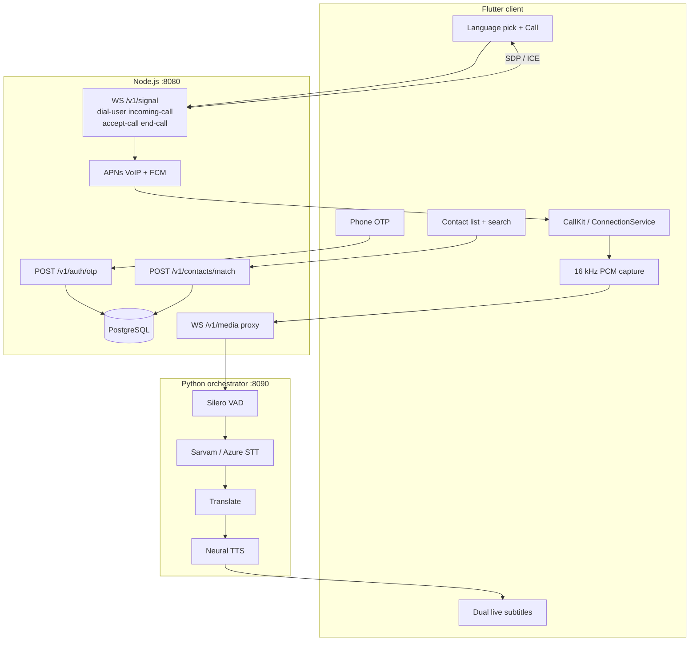

# TranslateLanguage

Cross-platform **live voice-translation phone calls** for iOS and Android.
Speaker A talks in Tamil; Speaker B hears neural Hindi in near real time,
and the reverse path runs independently.

Flutter client · Node.js signaling (CallKit / ConnectionService / WebRTC) ·
Python media orchestrator (STT → translation → TTS).

---

## Architecture

Naive A↔B WebRTC P2P delivers *original* speech. A translator call must
**replace** that audio. Each phone therefore peers with a **translation
gateway**, not with the other phone. CallKit and ConnectionService still
present a native system call.



One utterance (A → B):

```
Mic PCM 20ms → Silero VAD (~180ms silence) → streaming STT
  → translate → streaming TTS first-byte → jitter 40ms → earpiece
Target: < 1.0 s from mouth-stop to first translated sample.
```

---

## Repository layout

```
TranslateLanguage/
├── docker-compose.yml          # postgres + signaling + orchestrator
├── backend/
│   ├── signaling/              # Node.js
│   │   └── src/
│   │       ├── auth/           # OTP + JWT
│   │       ├── contacts/       # address-book match
│   │       ├── devices/        # VoIP / FCM tokens
│   │       ├── db/schema.sql
│   │       ├── handler.ts      # dial-user, incoming-call, accept-call, end-call
│   │       ├── push.ts         # APNs VoIP + FCM HTTP v1
│   │       └── media/proxy.ts  # WS PCM → Python orchestrator
│   └── orchestrator/           # Python FastAPI Silero + STT/MT/TTS
└── mobile/lib/
    ├── screens/otp_phone_screen.dart
    ├── screens/home_screen.dart
    ├── screens/call_setup_sheet.dart
    ├── screens/in_call_screen.dart
    └── services/signaling_service.dart
```

---

## Quick start (mock pipeline, no cloud keys)

```bash
cp .env.example .env
docker compose up --build
```

Health:

- Signaling: http://127.0.0.1:8080/health
- Orchestrator: http://127.0.0.1:8090/health

Two-leg smoke test (silence in, mock TTS tone + transcripts out):

```bash
cd backend/orchestrator
python -m venv .venv && .venv/bin/pip install -r requirements.txt websockets
.venv/bin/python scripts/smoke_two_legs.py
```

On Windows PowerShell, use `.venv\Scripts\pip` and `.venv\Scripts\python`.

### Flutter client

From a machine with the Flutter SDK:

```bash
cd mobile
flutter create . --project-name translate_language --org com.translatelanguage
# Keep the files already in lib/, android/, ios/ — do not overwrite them.
flutter pub get
```

Run on two phones on your LAN (not 127.0.0.1):

```bash
flutter run --dart-define=API_HOST=192.168.1.10
```

1. Sign in with the SMS code sent to the phone number.
2. Allow contacts — registered numbers highlight with a green dot when online.
3. Tap a contact → pick Tamil / Hindi → **Call**.
4. Callee gets a native CallKit / ConnectionService ring (VoIP push if background).
5. Answer → PCM + subtitles start immediately.

---

## Switching on real STT / translation / TTS

Mix-and-match providers. The preset sets all three; overrides win.

```
PIPELINE_PROVIDER=sarvam          # google | azure | sarvam | mock
STT_PROVIDER=sarvam               # google_v2 | azure | sarvam | mock
TRANSLATOR_PROVIDER=openai        # google | azure | sarvam | openai | anthropic
TTS_PROVIDER=azure
VAD_BACKEND=silero                # silero | webrtc
VAD_SILENCE_MS=180

SARVAM_API_KEY=...
OPENAI_API_KEY=...                # gpt-4o-mini
ANTHROPIC_API_KEY=...             # claude-haiku-4-5
AZURE_SPEECH_KEY=...
AZURE_SPEECH_REGION=centralindia
GOOGLE_PROJECT_ID=...
GOOGLE_STT_MODEL=latest_short     # Speech-to-Text V2
```

Indic locales: `hi-IN`, `ta-IN`, `te-IN`, `ml-IN`, `gu-IN`, `mr-IN`.
Use the **same region as the users**. That matters more than model choice for the 1 s budget.

---

## Latency playbook (hit < 1 s)

| Do | Don't |
|----|-------|
| Silero cut at ~180 ms silence | Wait for punctuation / 400 ms VAD |
| 20 ms PCM frames, LINEAR16 | MP3/AAC, 100 ms chunks |
| Sarvam realtime `stream_type=fast` or Google V2 interims | `latest_long` / batch recognize |
| Speculative TTS on 4+ char interims | Buffer a full paragraph |
| gpt-4o-mini/Haiku with 120 tokens, or Mayura NMT | Chatty LLM prompts |
| Streaming TTS, play after 2 frames | Full WAV then send |
| `languages.set` / `config.update` on the open socket | Reconnect STT to switch language |
| Half-duplex ducking + barge-in + earpiece | Speakerphone without AEC |

Full budget table: [`docs/LATENCY.md`](docs/LATENCY.md).

---

## Native call UX

- **iOS:** PushKit VoIP → `CXProvider.reportNewIncomingCall` within ~2 s,
  audio session `PlayAndRecord` + `voiceChat`, start WebRTC in
  `didActivate audioSession`. See `mobile/ios/Runner/AppDelegate.swift`.
- **Android:** FCM high-priority data → `ConnectionService` /
  `flutter_callkit_incoming`, `MODE_IN_COMMUNICATION`, microphone FGS
  on Android 14+. See `mobile/android/.../AndroidManifest.xml`.

Details: [`docs/NATIVE_CALLS.md`](docs/NATIVE_CALLS.md).

---

## Protocol (orchestrator)

First text frame:

```json
{
  "type": "session.start",
  "call_id": "uuid",
  "peer_id": "user-a",
  "src_lang": "ta-IN",
  "dst_lang": "hi-IN",
  "sample_rate_hz": 16000
}
```

Binary frames: 8-byte little-endian header + PCM16LE.

| offset | field |
|--------|--------|
| 0 | `u32 seq` |
| 4 | `u8 kind` 1 = mic uplink, 2 = TTS downlink |
| 5 | `u8 flags` bit0 = utterance end |
| 6 | `u16 reserved` |

Control events: `transcript.partial` / `transcript.final`, `tts.start` /
`tts.end` / `tts.cancel`, `audio.duck`, `latency`.

---

## Production gaps to close before store submission

1. **TURN (coturn)** — cellular symmetric NAT will fail ICE without it.
2. **APNs VoIP p8 + FCM v1** — fill in `backend/signaling/src/push.ts`.
3. **Auth** — replace the demo `/v1/token` with real user identity.
4. **Single capture graph** — tap WebRTC ADM instead of a second `record`
   plugin so iOS audio sessions do not fight.
5. **Barge-in** — cancel TTS when local VAD fires mid-playback.
6. **GPU IndicTrans2** — swap `Translator` for on-prem MT if cloud RTT
   from India is the bottleneck.
7. **Observability** — export `LatencyProbe` stages to OpenTelemetry.

This repository is a complete, wired **architecture + implementation
template**: every hop exists, mock providers run offline, Google/Azure
providers drop in via env, and the mobile UI covers language selection
plus live bilingual subtitles during a CallKit/Telecom call.
